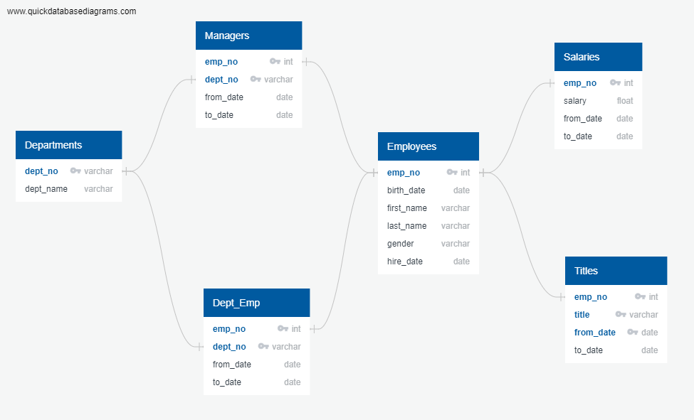
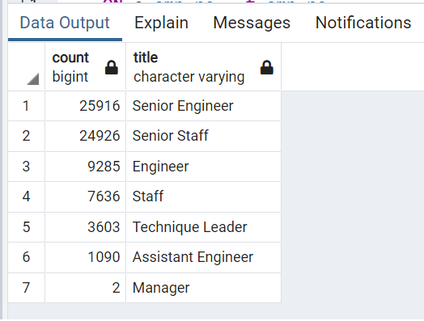
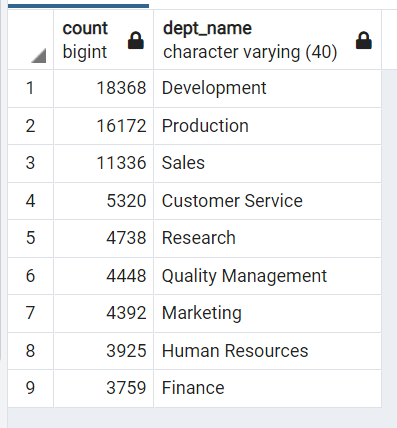
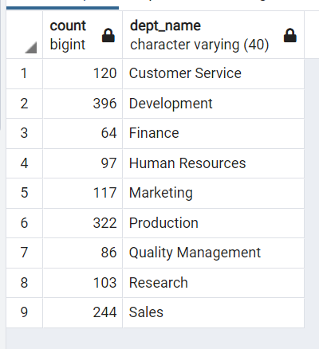
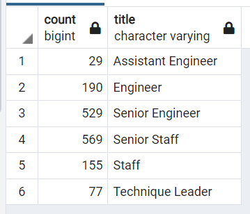

# Pewlett-Hackard Analysis

## Overview 
This project aims to analyse the Pewlett-Hackard database to identify employees close to retirement by title. Also, create a pool of employees eligible for a mentorship program as part of a succession plan strategy. This analysis was made using Postgre SQL. Results from each query were exported to CSV files.

## Results

- Pewlett-Hackard employees database was created based on the following ERD

- For this project, all employees born between 1952 and 1955 were considered retirement-ready. 
- Currently, there are 72458 employees meeting that criteria. Below there is the total of employees ready to retire per job title.

- Senior Engineer and Senior Staff are the two job titles with the largest amount of retirement-ready employees, accounting for about 70% of the total.
- The eligibility criteria for mentorship were also based on birth date. This group contains all employees born in 1965, a total of 1549 employees.

## Summary

From the results, it is possible to notice that this scenario will impact 72458 roles, that will likely need to be filled soon. Below, there are the results of three queries, one with retirement-ready employees by department, the second with the mentorship-eligible by department, and the last with mentorship-eligible by title.

- Retiring employees by department

      

- Mentorship-eligible by department

    

- Mentorship-eligible by title

    

Since the number of possible retirees surpasses by large the mentorship eligible, considering department and title, it is possible to affirm that there are enough mentors available.

Still, it might be needed to increase the eligibility criteria to prepare a larger group of employees able to replace the ones retiring, based not only on age. An effective succession plan should take into consideration employees' skills, competencies, performance reviews as well as career goals.
